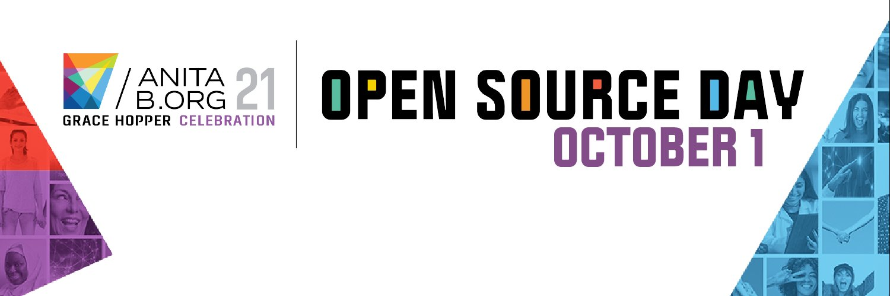

Code and learn with contributors around the world at the largest female-led movement 💪  in #OpenSource on July 15th, 2021. #OpenSourceDay2021 has experienced mentors so YOU can level-up your skills during this virtual hackathon. 💻 

Stay for only an hour long workshop or feel free to stay for the entire day. Choose from a variety of open source projects and have the opportunity to learn from women technologists all over the world. Every little contribution - no matter how big or small - will count towards an impact that will benefit the entire open source community. Come make history in the open source community here: https://opensourceday.anitab.org/
#OpenSourceDay2021 

 
 
 

